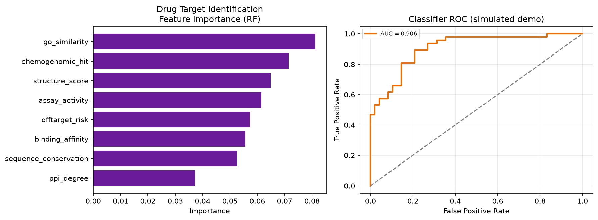

# Machine Learning for Drug Target Identification in Bioinformatics

## Overview
This repository contains a scientific blog adaptation, reproducible analysis scripts, and notebook workflows for the topic: **Machine Learning for Drug Target Identification in Bioinformatics**.

## Repository Structure
- Guidelines_Research_Paper_Review.txt: review-to-blog writing guide
- blog_post.md: scientific blog post adapted from the guideline
- .ipynb, .py, .R: detailed computational workflows
- .gitattributes, .gitignore, LICENSE, requirements.txt: repository setup files

## Reproducibility
1. Create a Python environment.
2. Install dependencies from requirements.txt.
3. Run the Python and R scripts.
4. Open the notebook for interactive analysis and figures.

## Visualizations

Running the project’s primary Python analysis script regenerates a committed overview figure used below:

Random-forest feature importances for bioinformatics target scores and target-classifier ROC.

> Demonstration figure generated from synthetic/demo inputs unless a licensed dataset is provided locally.

## Notes
This project is structured for publication-style transparency and educational reuse.

**Last Updated**: August 2025
